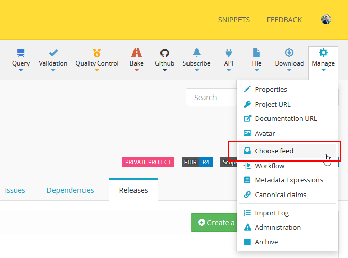
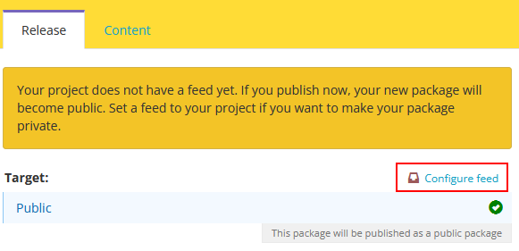
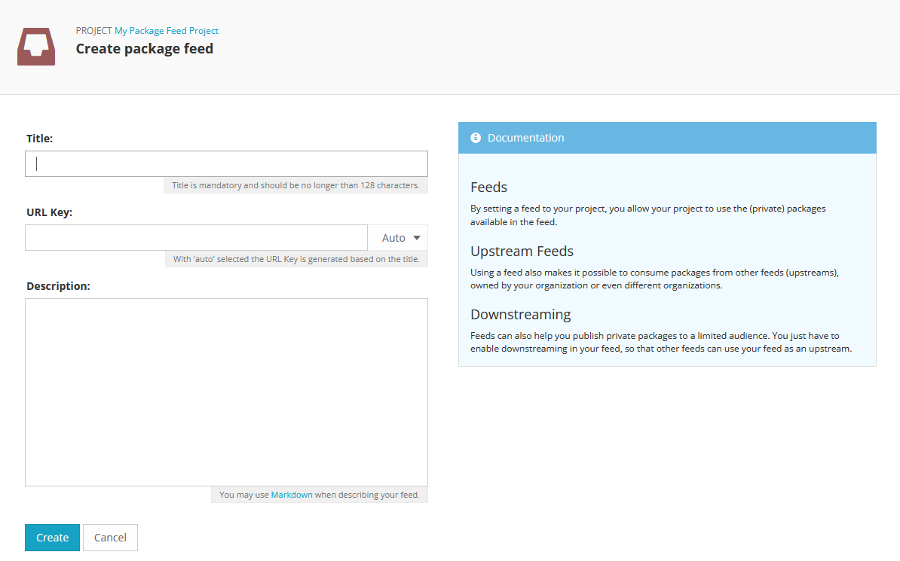
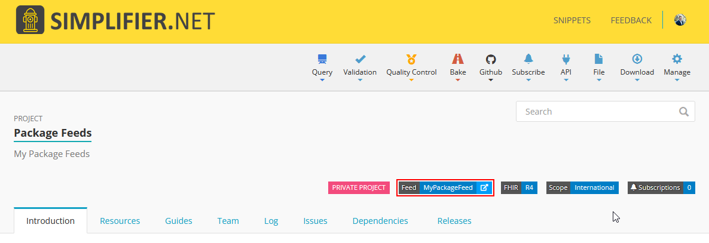
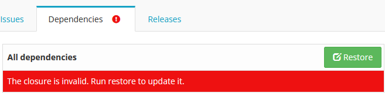

.. _package_feeds:

Package Feeds
=============

What is a package feed?
-----------------------

Plain-English explanation
~~~~~~~~~~~~~~~~~~~~~~~~~

You already know what a FHIR package is: a collection of FHIR resources such as profiles, extensions, and value sets that other projects can use as a dependency.

On Simplifier, public packages are published to the main public feed by default. A package feed is the place where published packages live.

A private package feed is a separate package space with its own access control. People can only see packages in that feed if they have access to the managing team.

Public vs. private feeds
~~~~~~~~~~~~~~~~~~~~~~~~

The public feed is shared and visible to everyone.

Private feeds are used for packages that should only be available to a specific team or group of collaborators.

Private packages can only be found and accessed through a feed. They no longer appear under the Packages tab on the portal, organization, or team pages.

Do I need one?
--------------

When a private feed helps
~~~~~~~~~~~~~~~~~~~~~~~~~

A private feed helps when you want to keep packages internal, share work in progress with a controlled group, or depend on private packages managed by your team.

It is also useful when you are building an Implementation Guide based on profiles that should stay private.

When the public feed is enough
~~~~~~~~~~~~~~~~~~~~~~~~~~~~~~

If all your packages are public and you do not rely on private dependencies, the main Simplifier public feed is usually enough.

Key concepts before you start
-----------------------------

Feeds, teams, and projects
~~~~~~~~~~~~~~~~~~~~~~~~~~

A feed is linked to a team, and team members inherit access to the feed and its packages.

Every private package lives in exactly one feed. Your project must have a feed assigned before it can use private packages.

The Restore step
~~~~~~~~~~~~~~~~

After changing dependencies or assigning a different feed, run **Restore** from the **Dependencies** tab. Restore rebuilds the dependency closure for the project.

When the Restore button turns green, a restore is required.

Set up a feed (step by step)
----------------------------

1. Make your project private
~~~~~~~~~~~~~~~~~~~~~~~~~~~~

Private feeds can only be used with private projects. If your project is public, set it to private first.

2. Assign a feed
~~~~~~~~~~~~~~~~

In your project, go to **Manage > Choose Feed**.

You can select an existing feed or create a new one.

When creating the feed, provide:

* **Feed key**: a short URL-safe identifier such as ``my-org-internal``. The key is globally unique across Simplifier.
* **Title**: a readable name for the feed.
* **Managing team**: the team whose members get access to the feed.

After creation, the feed is assigned and visible on your project page.

3. Run Restore
~~~~~~~~~~~~~~

Go to the **Dependencies** tab and run **Restore**.

This rebuilds the dependency closure using the assigned feed.

4. Publish a package
~~~~~~~~~~~~~~~~~~~~

Go to **Releases** and create a new release. Confirm that the package is being published to the intended feed.

5. Use it in another project
~~~~~~~~~~~~~~~~~~~~~~~~~~~~

Assign the same feed to the other project, add the package from the **Dependencies** tab, and run **Restore**.

Common questions
----------------

I can't find my feed to assign it - why?
  Feeds can only be assigned to projects managed by the same team as the feed.

I added a dependency but my project can't see it.
  Usually, the project needs a **Restore** before the dependency becomes available.

Can I use packages from two different feeds?
  Not directly in one project feed assignment. Use upstream feeds when you need one feed to draw from another. The upstream feed must be permanent, and both feeds must be managed by the same team.

Can I make a package public after publishing to a private feed?
  No. Private-to-public promotion is not currently supported.

Need more detail? See the :doc:`Technical reference <simplifierPackageFeedsTechnicalReference>`.

