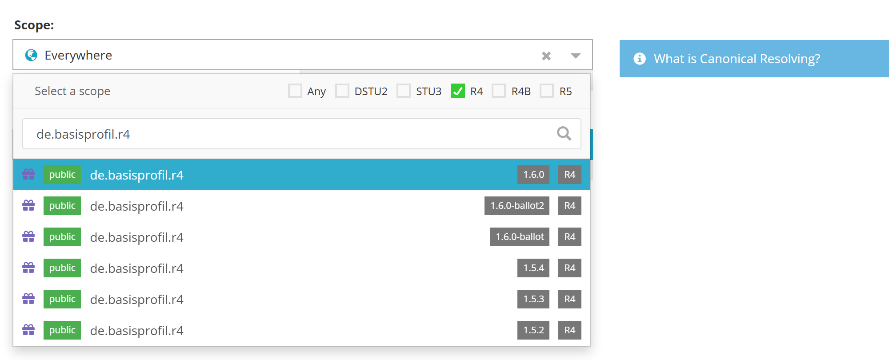
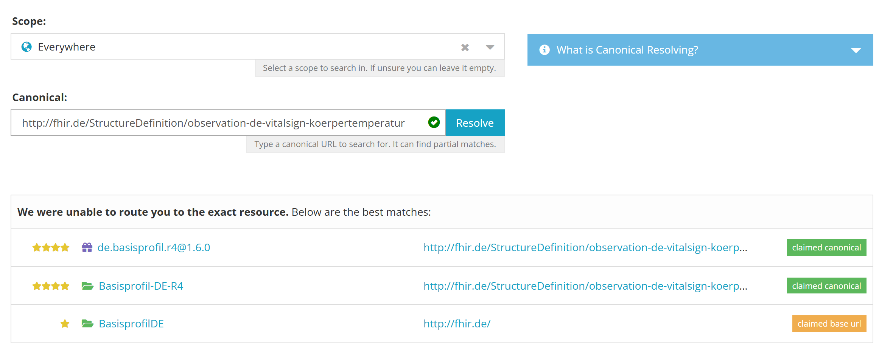
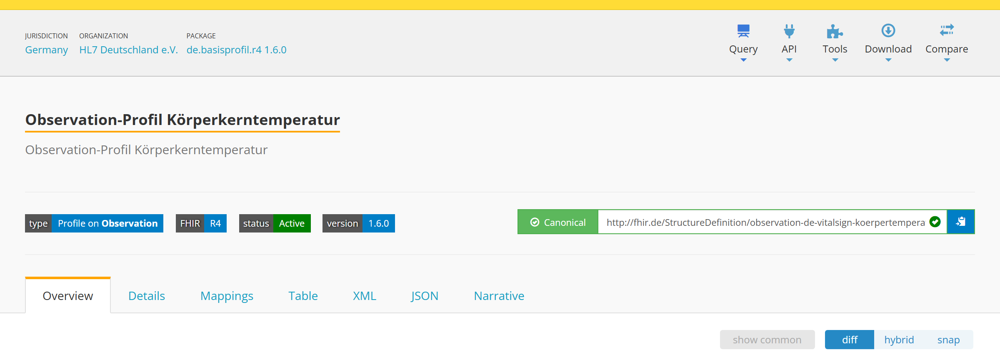

.. _canonical_resolving:

Resolving canonicals
^^^^^^^^^^^^^^^^^^^^

Every conformance resource in FHIR has a canonical URL, but that URL is an identifier and not
necessarily a working web address. Simplifier's resolve page turns a canonical into a link you can
actually follow: enter a canonical on `simplifier.net/resolve <https://simplifier.net/resolve>`_ and
you are taken to the documentation for that resource.

Where you end up is controlled by the *documentation URL* of the package or project that holds the
resource. If none is set, Simplifier falls back to the resource page on Simplifier itself. See
:ref:`documentation_url` below to point resolving at your own IG instead.

Choosing a scope
----------------

A canonical is only unique within the specification that defines it, so the same canonical can occur
in several packages and projects. The scope tells Simplifier where to look.

Selecting a package or project as the scope is best practice: it guarantees you land on the version
you meant. Use the FHIR version filter (``Any``, ``DSTU2``, ``STU3``, ``R4``, ``R4B``, ``R5``) to
narrow the package list, then pick the version you want.

Leaving the scope on ``Everywhere`` also works, but for R4 and later it is unreliable, because the
core packages and many national profiles reuse canonicals across FHIR versions. If you resolve
without a scope, Simplifier defaults to ``hl7.fhir.r4.core 4.0.1``.

Ranked matches
--------------

When Simplifier cannot route you to exactly one resource, it lists the candidates it found instead,
ranked best first. Resolving
``http://fhir.de/StructureDefinition/observation-de-vitalsign-koerpertemperatur`` with no scope gives:

The stars are a relevance score. A candidate scores higher when its canonical was actually found in
the scope (rather than only matching a claimed base URL), when the scope is a package rather than a
project, and when the scope's FHIR version matches the one you asked for. The label on the right
tells you which kind of match it is:

.. list-table::
  :header-rows: 1
  :widths: 25 75

  * - Label
    - Meaning
  * - ``claimed canonical``
    - The canonical was found in this scope, and the scope has claimed the base URL. Most reliable.
  * - ``unclaimed canonical``
    - The canonical was found in this scope, but the base URL is not claimed.
  * - ``claimed base url``
    - The canonical itself was not found, but this scope has claimed its base URL. A likely owner.
  * - ``conflict``
    - More than one scope claims this base URL. Pick the scope explicitly.

Claiming your base URLs on your package or project makes your own resources rank first here. See
:ref:`canonical_claims`.

Picking the top match, ``de.basisprofil.r4@1.6.0``, resolves straight to the profile:

Building a resolve URL yourself
-------------------------------

Besides using the resolve page, you can construct a resolve URL directly, for example to put in your
own documentation. This is the equivalent of the example above:

.. code-block:: none

  https://simplifier.net/resolve?scope=de.basisprofil.r4@1.6.0&canonical=http://fhir.de/StructureDefinition/observation-de-vitalsign-koerpertemperatur

The base is always ``https://simplifier.net/resolve?``, followed by these parameters:

.. list-table::
  :header-rows: 1
  :widths: 20 80

  * - Parameter
    - Description
  * - ``scope``
    - Package name or project URL key, optionally with ``@`` and a version:
      ``de.basisprofil.r4@1.6.0``. Use ``@latest`` for the newest version of a package, or a
      version range such as ``@1.6.x`` for the highest version in that range. For a live
      project the scope is always ``@current``. When a scope is given, the FHIR version is derived
      from it.
  * - ``fhirVersion``
    - ``DSTU2``, ``STU3``, ``R4``, ``R4B`` or ``R5``. Only needed when you do not pass a ``scope``.
  * - ``canonical``
    - The canonical URL of the resource you want to resolve to.
  * - ``filepath``
    - Resolve by path within the package instead of by canonical, for example
      ``package/StructureDefinition-Patient.json``.
  * - ``reference``
    - Resolve by ``<type>/<id>``, for example ``Patient/3``.
  * - ``name``
    - Resolve by resource name.
  * - ``best``
    - Set ``best=true`` to let Simplifier pick the highest scoring scope for you instead of passing
      one. Handy when you do not know which package owns the canonical.
  * - ``target``
    - Override which documentation to send the user to: ``preferred`` (the publisher's choice),
      ``source`` (the Simplifier page for the content), ``package``, ``project`` or ``guide``.
  * - ``tab``
    - Open a specific tab on the target page, for example ``tab=xml``.

The scope can also go in the path instead of the query string:
``https://simplifier.net/resolve/de.basisprofil.r4@1.6.0?canonical=...``.

The ``scope`` version can be an exact version, ``latest``, or a version range. A range resolves to
the highest version of the package that matches it: ``de.basisprofil.r4@1.6.x`` and
``de.basisprofil.r4@1.6`` both resolve to the highest ``1.6`` version, and ``de.basisprofil.r4@1.x``
to the highest ``1`` version. This keeps a link in your own documentation pointing at the latest
patch release without editing it for every release.

.. note::
  If no version of the package matches, Simplifier falls back to the newest version of the package
  and shows a warning.

.. _documentation_url:

Documentation URL
^^^^^^^^^^^^^^^^^

The documentation URL determines where resolving lands. Set it if you publish your own IG and want
readers to arrive there rather than on Simplifier.

To edit it, choose ``Settings`` on a resource page or on the project page, then ``Documentation URL``.
You can set it for a single resource, or once at project level for every resource in the project,
because Simplifier applies it as a template.

Available template variables:

.. list-table::
  :header-rows: 1
  :widths: 20 80

  * - Variable
    - Value
  * - ``{canonical}``
    - The canonical URL of the resource.
  * - ``{type}``
    - The resource type, for example ``StructureDefinition``.
  * - ``{basetype}``
    - The core base type the profile constrains, for example ``Patient``.
  * - ``{id}``
    - The resource id.
  * - ``{projectkey}``
    - The project URL key as used in Simplifier's own URLs.
  * - ``{filekey}``
    - The file URL key as used in Simplifier's own URLs.
  * - ``{filepath}``
    - The path of the file within the package.

So a single project level template like
``https://example.org/ig/{type}-{id}.html`` works for every resource in the project.

If no documentation URL is set, Simplifier defaults to the resource page on Simplifier itself.
