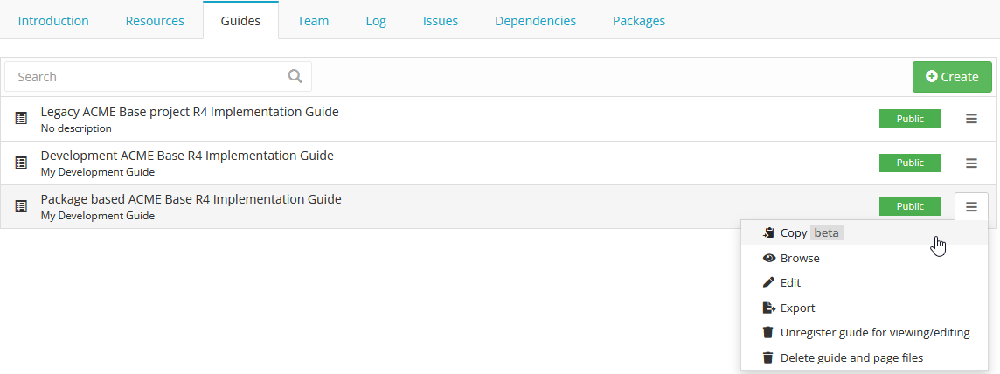
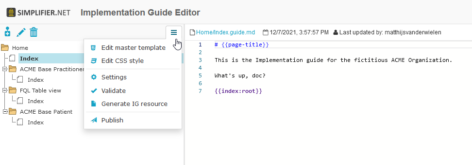
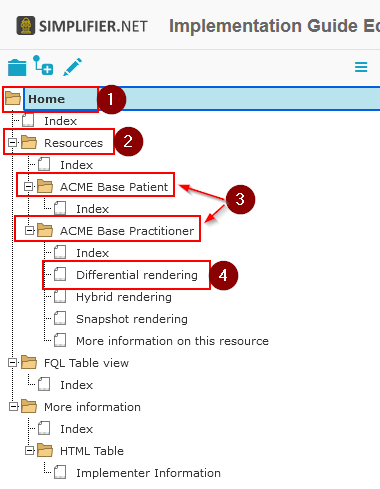
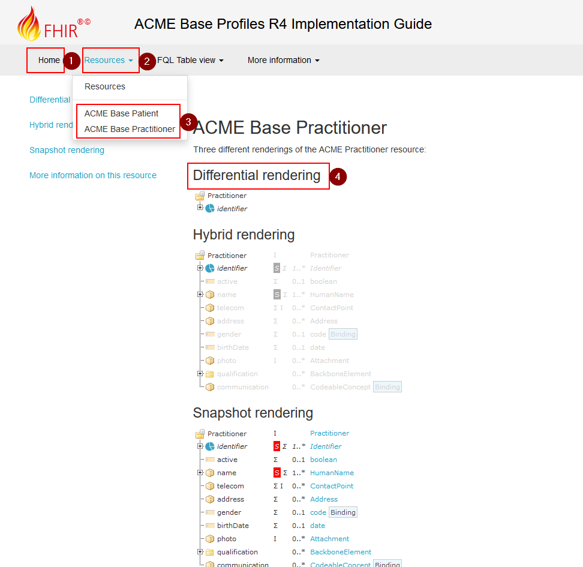
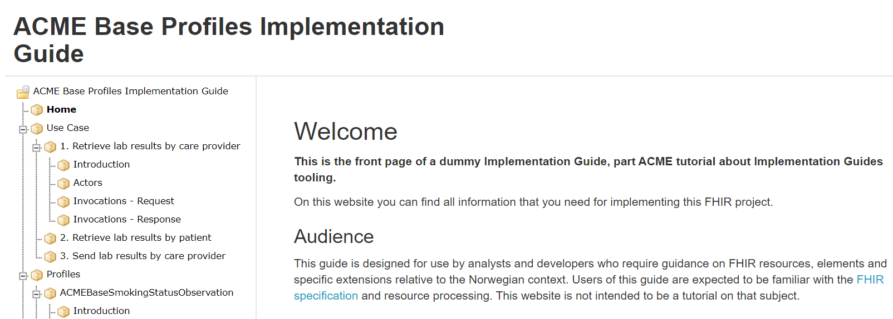
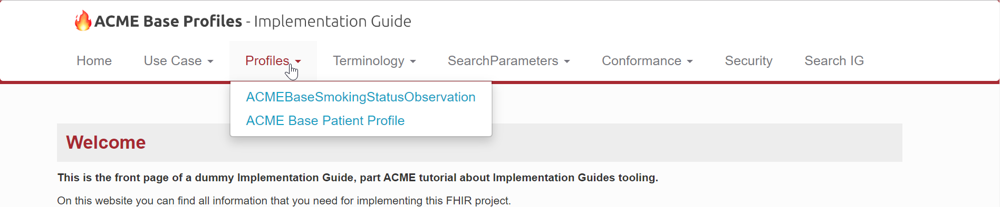
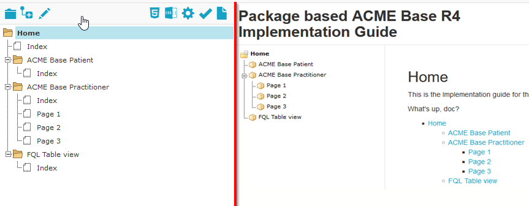

Create your first IG
====================

You can access the IG editor via the ``Guides`` tab in your project. Use the ``Create`` button to create a new Implementation Guide and provide a title for the IG. Simplifier will automatically generate a URL Key, but you can choose your own URL Key.

Click on ``Browse`` or the Implementation Guide itself for a preview of the guide. Click on the ``Edit`` button to open the Implementation Guide in the IG editor. In the bottom left a help section is available to get started with adding images, tree renderings, and more.

The IG editor
-------------

The IG editor opens on the page of the root folder. Simplifier stores newly created IGs in a folder-based structure, allowing you to easily ``copy`` guides and maintain multiple versions of your guides.

To adjust the settings of your IG, click on the Settings icon (the gear wheel). This lets you adjust the title and privacy on the Settings tab, or select an IG rendering format and stylesheet on the Style tab. In the settings you can also select a ``scope`` for your guide. The scope determines where the rendered resources in your guide come from: released packages or your live development project.

The IG editor consists of three sections. On the left is the IG's tree table, used to define the outline of your IG and navigate between pages. The middle section is the editor. The right section previews the actual IG page. Drag the section bars to resize each section.

The IG folders work as follows:

- Home folder (1)
- Subsection folders (2)
- Subsection pages (3)
- Subsection page paragraphs (4)

In the IG rendering, when using a custom ballotable IG design, it looks like this:

The information on the ``index`` node is rendered on the Home, subsection folder, or subsection pages. When more pages are added below the index file, these are rendered as paragraphs for that page. To use this, make sure the first page in a folder is named ``index``.

.. tip::

   In the bottom left of the IG editor you will find the help tab with examples, tips, and tricks.

Markdown
--------

The middle section is a Markdown-based editor used to compose your IG content. Markdown is a text-to-HTML conversion tool that lets you write using an easy-to-read, easy-to-write plain text format. This `Markdown cheat sheet <https://github.com/adam-p/markdown-here/wiki/Markdown-Cheatsheet>`_ gives an overview of the features you can use.

A short summary of frequently used features:

- Headings, from ``# Heading 1`` to ``###### Heading 6``
- *Italics* with ``*asterisks*`` or ``_underscores_``
- **Bold** with ``**asterisks**`` or ``__underscores__``
- Strikethrough with two tildes: ``~~scratch this~~``

For the full authoring reference (page headers, links, images, tables, variables, and templating), see :ref:`Page setup and reuse <ig_page_setup>`.

Rendering format
----------------

An IG can be rendered in one of three formats: a Tree table, a Two Level Menu, or HL7 format (work in progress).

A **Tree table** rendering displays your IG with the elements and their hierarchy along the left side of the page.

A **Two Level Menu** rendering displays your IG with the elements in tabs along the top of the page.

An **HL7 format** rendering displays the elements in tabs along the top of the page like the Two Level Menu, but in the style of an HL7 IG.

Every folder contains an index file, displayed as the folder's homepage, and can have child pages added with the ``+`` icon. The image below shows the folder structure on the left and the rendered Implementation Guide on the right:

Next steps
----------

- :ref:`Rendering FHIR resources <ig_rendering_fhir>`: embed trees, tables, and resources in your pages with widgets.
- :ref:`Page setup and reuse <ig_page_setup>`: page headers, variables, templating, links, and images.
- :doc:`Customizable IG design <customize_your_ig>`: styles, templates, and CSS (Team plan and up).
