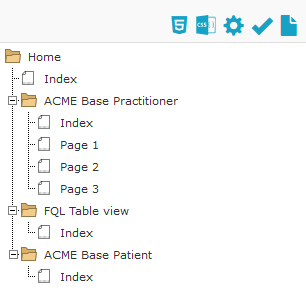
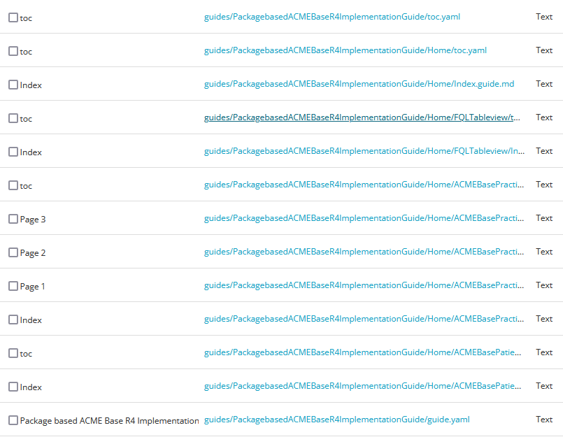
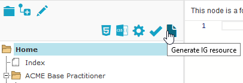
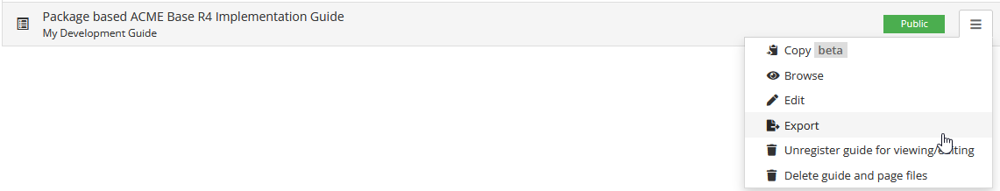
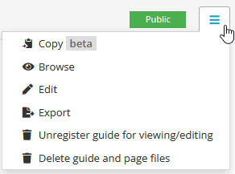
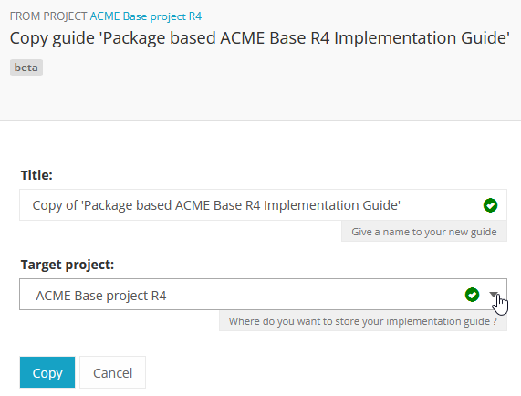

.. _implementation_guide_management:

Implementation Guide management
===============================

.. _ig_storage:

IG Storage
----------

Since release 28.0 IG's all files belonging to an IG are saved in the same folder. No longer in the root of the project and not in different folders. The folder name will be the same as the IG name. 

To illustrate how this works, see the screen picture of an example IG containing three topics with one or more pages for each topic. 

In the project's filemanager you can see the different folder structures for each guide. 

To Save your IG as a Resource, click on the ``Generate IG resource`` button in the left pane of the IG-editor. Note that it is the tree structure that is saved. Textual changes are save automatically.

.. _ig_export:

Export your IG
--------------

.. important::

    This feature is available from the Professional plan and up. `See the pricing page for details. <https://simplifier.net/pricing>`_

To use your IG outside of Simplifier, click on the Export button next to your IG in the Guides section of your project. 

.. _ig_copy:

Create a copy of your IG
------------------------

Since the release of Simplifier 28.0 it is possible to create a copy of your Implementation guide.

A guide can be copied to the same project or to another project. The ``Target project:`` dropdown provides an list of all of your projects where you can create a copy of your IG. 

You can now have multiple version of your Implementation Guide live in the same project (or different projects). You could have one IG use a release package as the scope while the development version uses the live development version of your project. 

.. _ig_convert:

Convert guide.yaml to a Simplifier web-based IG.
------------------------------------------------

Sometimes you see an implementation guide on Simplifier that just simply blows you away and you want to see how this has been created. Luckily, you can create a copy of those guides in a project of your own and take a look at their IG editor content. 

Guides created after August 2021 are stored in the new folder based storing way. These implementation guides can still be converted to a Simplifier web-based IG in a (private) project using the guide.yaml file. 

Please follow these steps to create your own edition of a Simplifier IG. 

1. Download the project containing the desired guide as a .zip file.
   
2. Upload the .zip to (preferably private) project.
   
3. Go to ``manage`` > ``File manager``. 
   
4. Search for guide.yaml. 
   
5. Open desired guide.yaml for the guide you want to create. 
   
6. Click on ``Update`` followed by ``Edit: Create IG and start updating in IG Editor``.

7. Wait for the IG to be created and you are good to go. 

Convert ImplementationGuide resource to a Simplifier web-based IG
-----------------------------------------------------------------

.. important::

    This feature only works for Legacy guides in order to ensure backwards compabibility and will therefore create a guide in the legacy way of Markdown files.

An ImplementationGuide resource can be converted to a Simplifier web-based IG. This comes in handy if you for example accidentally deleted your IG or if you want to duplicate your IG in another project.

- Make sure that the project contains the ImplementationGuide resource and all the belonging content (.md pages, images, etc.)

-	Locate the an ImplementationGuide resource. 

-	Click on ``Update`` followed by ``Edit: Create IG and start updating in IG Editor``. This will convert the ImplementationGuide resource to a Simplifier IG. 

- Follow the configuration steps and locate the IG in the Guides tab.

**Note**: If you want to export and import a project through a .zip you have to make sure that the folder structure is the same as in the project, to make sure links between IG resources are still in tact. Zipping a containing folder will include the folder in the zip-file. To make sure no extra layer of folders is added, directly zip the resources within a folder instead.

.. _ig_broken_link:

Repair a broken link between guide.yaml and your guide
-------------------------------------------------------

Every guide on Simplifier is registered separately from its files. The registration holds the guide's URL key, its settings, its published versions, and a pointer to the ``guide.yaml`` file in your project. A guide only opens as long as that pointer resolves.

The pointer breaks when the ``guide.yaml`` in your project is replaced by a new file: deleted and recreated, renamed, or moved to another folder. In practice this happens through a GitHub sync that restructures the guide folder, a project zip upload that adds an extra folder layer, or a delete in the file manager. Putting an identical ``guide.yaml`` back does not fix it, because the restored file is a new file and the registration still points at the old one.

The guide keeps showing up in the ``Guides`` tab, but opening it gives this error:

You repair it by removing the registration, registering the guide again from the ``guide.yaml`` that is now in your project, and re-attaching the published versions to that new registration.

.. important::

   Published versions are static snapshots, and nothing below affects them. They stay online throughout, and they keep the guide's URL key reserved. That is why you need a temporary URL key in step 3.

1. **Remove the broken registration.** Open the guide's menu in the ``Guides`` tab of your project, or on the guide's ``Versions`` page, and choose ``Delete guide and page files``.

   .. image:: ../images/IGBrokenGuideMenu.png
      :scale: 75%

   Despite its name, this leaves your pages alone: because the link is broken, Simplifier cannot resolve the guide folder, so it removes the registration and leaves every file in the project. Download a backup of your project first anyway.

   ``Unregister guide for viewing/editing``, which normally removes the registration without touching the files, is not offered while the link is broken.

2. **Check that the guide files in your project are complete and correct.** The guide folder must contain the ``guide.yaml`` and the folder structure it refers to. If you work through GitHub, push your changes and use ``Reimport`` in the GitHub menu to force a full sync. If you upload a zip, zip the contents of the folder rather than the folder itself, so no extra folder layer is added. See :ref:`IG Storage <ig_storage>` for the expected structure.

3. **Register the guide again, under a temporary URL key.** Go to ``Manage`` > ``File manager``, open the ``guide.yaml`` of your guide and click ``Update`` followed by ``Edit: Create IG and start updating in IG Editor``, as described under :ref:`Convert guide.yaml to a Simplifier web-based IG <ig_convert>`.

   The original URL key is still reserved by the published versions, so entering it is refused with ``This urlkey is not available. Please choose a different one.`` Pick a free key for now, for example the original key with ``-tmp`` appended.

   .. image:: ../images/IGRecreateUrlKeyTaken.png
      :scale: 75%

   Simplifier creates the guide and opens it in the IG editor. Your guide now renders again under the temporary key, but its published versions are not attached to it yet.

4. **Link the published versions and set the URL key back.** Attach the guide's published versions to the new registration and give it the original URL key again, as described under :ref:`Link a guide to an existing published guide <link_published_guide>`. Your guide, its published versions and all existing links to them then work as before.

If the guide still does not open after this, contact Simplifier support through your `JIRA portal <https://firely.atlassian.net/servicedesk/customer/portal/1>`_ or email us at simplifier@fire.ly.

.. _ig_GitHub:

Manage your IG using GitHub
---------------------------

The GitHub webhook enables you to manage your Implementation Guide (IG) without using the editor interface directly. Detailed instructions for setting this up can be found in the `GitHub integration documentation <../adding_content/github.html#github-webhook-to-manage-implementation-guides>`_.

Implementation Guides are now organized in a folder-based structure, providing greater flexibility for templating and editing. Each IG includes a configuration file called guide.yaml and requires a specific folder structure to function correctly. If you still have a legacy guide, we highly recommend migrating to the new IG style. 

When you create an IG using the Simplifier UI, an initial guide.yaml file and the required folders are automatically generated. It is advisable to add a few folders and empty pages to familiarize yourself with the required structure. Once this is done, you can move your IG to GitHub. 

To do this, download the project locally (extract it) and copy your IG to your GitHub repository. Make sure to maintain the same folder structure as in the downloaded project. This applies to both the guide folders and your resources. Any changes to the folder structure may result in duplicates or break the link to the guide.yaml file, causing issues with rendering. If this occurs, see :ref:`Repair a broken link between guide.yaml and your guide <ig_broken_link>`. 

Once everything is set up, you can make changes locally using your preferred editor and sync them back to Simplifier.

