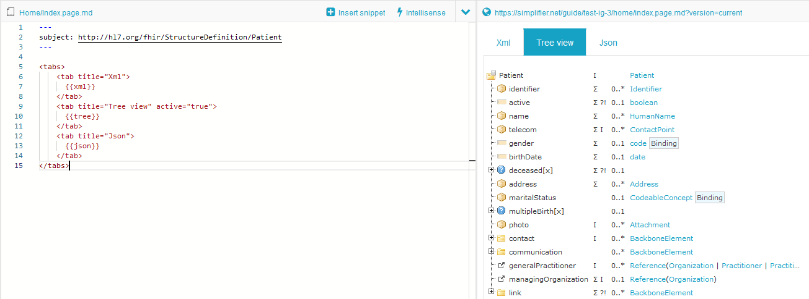
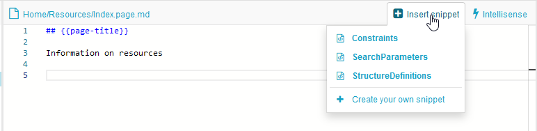

.. _ig_rendering_fhir:

Rendering FHIR resources
========================

The IG editor lets you embed Simplifier content (resource trees, tables, raw resources, and more) using placeholder widgets. Type a widget in the editor, then refresh the preview with ``Ctrl + Enter`` or the Refresh button to make it visible.

Reference a resource by its **canonical URL** (recommended, as the link keeps working when the guide is exported or duplicated) or by its filepath. The rendered content comes from the guide's **scope**, which you set in the IG settings.

Finding resources (Intellisense)
--------------------------------

Simplifier has an Intellisense that helps you find the resource you want to render. It is triggered automatically after you type a command, for example ``{{tree:``. There are three modes:

- **Canonical** (default): all canonical URLs in your guide's scope.
- **Files**: all files in your scope, together with your package dependencies.
- **Global**: all public projects and packages on Simplifier.

Toggle between modes with the buttons at the bottom right of the editor, by pressing ``F1`` and choosing 'Change intellisense mode', or with ``Ctrl + I``. The mode only changes how Intellisense suggests; every valid render syntax works regardless of the selected mode.

Widgets
-------

The following widgets embed Simplifier content. Most take a canonical URL (or a resource id for examples):

- ``{{tree:canonicalUrl}}`` renders a StructureDefinition as a tree, as seen on the resource overview tab.
- ``{{table:canonicalUrl}}`` renders the resource table.
- ``{{dict:canonicalUrl}}`` renders the *dictionary*: a table with the extended details of every element of a profile.
- ``{{json:canonicalUrl}}`` / ``{{xml:canonicalUrl}}`` render the resource as JSON or XML (the narrative is removed before rendering).
- ``{{narrative:canonicalUrl}}`` renders the resource's narrative. If the narrative is empty, the widget renders nothing.
- ``{{metadata:canonicalUrl}}`` renders a consistent table of metadata fields (see `Metadata`_).
- ``{{link:canonicalUrl}}`` links to the resource page on Simplifier. Add a title with ``{{link:canonicalUrl, title:'Base Patient'}}``.
- ``{{namingsystems:ProjectName}}`` lists all naming systems of a project in a table.
- ``{{render:canonicalUrl}}`` renders and parses any file type; ``{{source:canonicalUrl}}`` renders any file unparsed (preserving indentation and line breaks).
- ``{{index:root}}`` / ``{{index:current}}`` add an index (see `Index`_).

Tree and render properties
--------------------------

The ``tree`` widget accepts properties that control how it renders:

- Form: show the ``diff``, ``snap``, or ``hybrid`` form of the resource.

  ::

     {{tree:http://hl7.org/fhir/StructureDefinition/Patient, diff}}
     {{tree:http://hl7.org/fhir/StructureDefinition/Patient, snap}}
     {{tree:http://hl7.org/fhir/StructureDefinition/Patient, hybrid}}

- ``buttons``: show ``diff``, ``snap``, and ``hybrid`` buttons so the reader can switch between them.

  ::

     {{tree:http://hl7.org/fhir/StructureDefinition/Patient, buttons}}

- ``expand``: fully expand the tree, or give a number for the level of expansion.

  ::

     {{tree:http://hl7.org/fhir/StructureDefinition/Patient, expand}}
     {{tree:http://hl7.org/fhir/StructureDefinition/Patient, expand: 2}}

- ``lang``: switch the rendering to the given language, if available.

  ::

     {{tree:http://hl7.be/fhir/be/StructureDefinition/Patient, lang: fr-BE}}

Metadata
--------

The ``metadata`` widget renders a table of metadata fields for the referenced resource:

::

   {{metadata:http://acme.org/StructureDefinition/profile-patient, render-metadata-title}}

The supported fields depend on the resource type:

- **Conformance resources**: ``url``, ``version``, ``publisher``, ``status``, ``experimental``, ``description``, ``purpose``, ``useContext``, ``contact``
- **MessageDefinition**: ``title``, ``event``, ``category``
- **StructureDefinition**: ``context`` (for extensions)

If no fields are specified, all non-empty fields are rendered in the FHIR-defined order. If fields are specified (``{{metadata:canonicalUrl, url, version, publisher}}``), only those are rendered, in the order listed. The optional ``render-metadata-title`` flag also displays a title with the resource type and ``name``.

Index
-----

The ``index`` widget renders a navigable index:

- ``{{index:root}}`` indexes the entire IG.
- ``{{index:current}}`` indexes the currently selected element.
- ``{{index:Home}}`` (any page URL key) indexes that specific page.

Tabs
----

You can group widgets into tabs on a guide page:

::

   <tabs>
       <tab title="Overview">
         {{tree:http://hl7.org/fhir/StructureDefinition/Patient}}
       </tab>
       <tab title="Xml" active="true">
         {{xml:http://hl7.org/fhir/StructureDefinition/Patient}}
       </tab>
   </tabs>

By default the first tab is active; use ``active="true"`` to activate another. Tabs can be customized further on the Team plan and up.

FQL tables
----------

With FQL you can create dynamic tables that retrieve information from the resources in scope. For the full language, see our :ref:`FQL documentation <fql>`.

.. code-block:: html

   <fql>
       from
           StructureDefinition
       select
           name, type, kind, url
       order by
           name
   </fql>

You can save FQL statements for reuse across pages and projects: the IG editor can save custom snippets to a ``.snippet.md`` file, usable on every page in that project and shareable across projects.

You can also keep a query in a ``.fql`` file and render it with ``{{render:my-query.fql, output:inline}}``.
