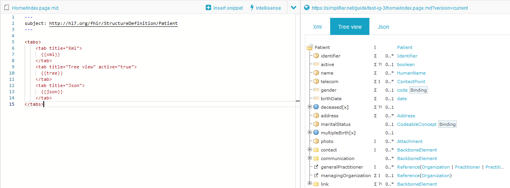
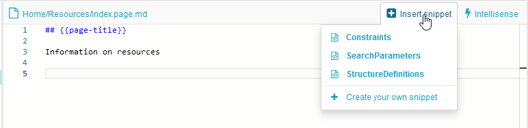

.. _ig_rendering_fhir:

Rendering FHIR resources
========================

The IG editor lets you embed Simplifier content (resource trees, tables, raw resources, and more) using placeholder widgets. Type a widget in the editor, then refresh the preview with ``Ctrl + Enter`` or the Refresh button to make it visible.

Reference a resource by its **canonical URL** (recommended, as the link keeps working when the guide is exported or duplicated) or by its filepath. The rendered content comes from the guide's **scope**, which you set in the IG settings.

Finding resources (Intellisense)
--------------------------------

Simplifier has an Intellisense that helps you find what you want to reference. It is triggered automatically after you type a command, for example ``{{tree:``. Pick which suggestions you get from the **Intellisense** menu in the editor toolbar. The menu has two sections: one for resources and one for pages.

Resources (used by widgets such as ``{{tree:``, ``{{table:`` and ``{{link:``):

- **Canonical** (default): all canonical URLs in your guide's scope.
- **Names**: the names of the resources in your guide's scope.
- **Files**: all files in your scope, together with your package dependencies.

Pages (used by the ``{{pagelink:`` and ``{{page:`` widgets):

- **Paths** (default): the filepaths of the pages in your guide.
- **Topics**: the topics set in the YAML headers of your pages. Pages without a topic are not suggested. Linking by topic is the recommended way to reference pages (see :ref:`pagelinkingTopic`).

The list filters as you keep typing. Cycle through the resource modes by pressing ``Ctrl + I``, or by pressing ``F1`` and choosing 'Change intellisense mode'. The selected modes only change what Intellisense suggests; every valid render syntax works regardless.

Widgets
-------

The following widgets embed Simplifier content. Most take a canonical URL (or a resource id for examples):

- ``{{tree:canonicalUrl}}`` renders a StructureDefinition as a tree, as seen on the resource overview tab.
- ``{{table:canonicalUrl}}`` renders the resource table.
- ``{{dict:canonicalUrl}}`` renders the *dictionary*: a table with the extended details of every element of a profile.
- ``{{json:canonicalUrl}}`` / ``{{xml:canonicalUrl}}`` render the resource as JSON or XML (the narrative is removed before rendering).
- ``{{narrative:canonicalUrl}}`` renders the resource's narrative. If the narrative is empty, the widget renders nothing.
- ``{{metadata:canonicalUrl}}`` renders a consistent table of metadata fields (see `Metadata`_).
- ``{{link:canonicalUrl}}`` links to the resource page on Simplifier. Add a title with ``{{link:canonicalUrl, title:'Base Patient'}}``.
- ``{{namingsystems:ProjectName}}`` lists all naming systems of a project in a table.
- ``{{render:canonicalUrl}}`` renders and parses any file type; ``{{source:canonicalUrl}}`` renders any file unparsed (preserving indentation and line breaks).
- ``{{form:canonicalUrl}}`` renders a Questionnaire as the form it describes, or a QuestionnaireResponse as the filled-in form (see `Questionnaires`_).
- ``{{index:root}}`` / ``{{index:current}}`` add an index (see `Index`_).

Tree and render properties
--------------------------

The ``tree``, ``dict`` and ``table`` widgets accept properties that control how they render a profile. Two of them work in pairs: ``modes`` and ``filters`` show a control the reader can use (the form buttons and the filter menu), and ``modes-selected`` and ``filters-selected`` say what the widget starts with.

- Form: show the ``diff``, ``snap`` (or ``snapshot``), or ``hybrid`` form of the resource. The views are explained under :ref:`resource rendering <resource-rendering>`.

  ::

     {{tree:http://hl7.org/fhir/StructureDefinition/Patient, diff}}
     {{dict:http://hl7.org/fhir/StructureDefinition/Patient, snap}}
     {{table:http://hl7.org/fhir/StructureDefinition/Patient, hybrid}}

- ``modes`` (or ``modes: yes``): show the ``diff``, ``snap``, and ``hybrid`` buttons, so the reader can switch between them. ``modes: no`` leaves them out again. Once the reader picks a view, their choice is remembered in a browser cookie and the buttons start with it, on this page and the next; without one they start in ``snap``. ``modes`` only takes ``yes`` or ``no``; the form to start with goes in ``modes-selected``. ``show common`` is in the filter menu (``filters``).

  ::

     {{tree:http://hl7.org/fhir/StructureDefinition/Patient, modes}}

- ``modes-selected``: the form to start with, ``diff``, ``hybrid`` or ``snap``. Unlike a form property, it replaces the view the reader chose before, as ``filters-selected`` does for the filters; with ``modes`` the reader can still switch. Without ``modes`` the widget shows that form, and the reader cannot switch. ``modes-selected: last`` starts with the view the reader chose before (else ``snap``), also when the page or guide sets a form.

  ::

     {{tree:http://hl7.org/fhir/StructureDefinition/Patient, modes, modes-selected: diff}}

- ``filters`` (or ``filters: yes``): add the filter menu: ``show common`` and the trait filters, as on the resource pages (see :ref:`resource rendering <resource-rendering>`). With ``modes`` it comes after the form buttons; without, it is on its own and the rendering keeps its form. ``filters: no`` leaves it out again, e.g. for one widget on a page that turns it on for all. ``filters`` only takes ``yes`` or ``no``; the filters to start with go in ``filters-selected``.

  ::

     {{tree:http://hl7.org/fhir/StructureDefinition/Patient, modes, filters}}
     {{dict:http://hl7.org/fhir/StructureDefinition/Patient, diff, filters}}

- ``filters-selected``: start with these filters selected, separated by a space (a comma separates the widget's properties). With ``filters`` the filter menu shows them checked, and the reader can change them; without, the rendering simply shows only the elements that match. They replace the filters the reader chose before. The filters are ``mandatory``, ``binding``, ``invariant``, ``mustsupport``, ``modifier`` and ``mapping``, the extension filter ``obligation`` (see `Extension filters`_), and the FHIRPath filters of the page (see `FHIRPath filters`_). An unknown name shows an error with the names you can use. ``filters-selected: none`` starts with no filter, also instead of what the reader chose before; ``filters-selected: last`` starts with what the reader chose before (else no filter), also when the page or guide selects filters.

  ::

     {{dict:http://hl7.org/fhir/StructureDefinition/Patient, filters-selected: mustsupport binding}}
     {{tree:http://hl7.org/fhir/StructureDefinition/Patient, modes, filters, filters-selected: mandatory}}

With ``modes`` or ``modes-selected`` on the widget, its page or the guide, the older ``buttons`` and the form properties (``diff``, ``hybrid``, ``snap``) are ignored. Without them these work as before: ``buttons`` shows the form buttons, with a ``show common`` button when the widget has no ``filters`` or ``filters-selected``, and a form property sets the view the buttons start with until the reader picks one; once picked, the reader's choice wins over the form property.

- ``filters-extension``: show the controls of these extension filters, separated by a space (or ``|`` or ``,``), in that order, e.g. ``obligation`` (see `Extension filters`_). ``filters-extension: all`` (or ``filters-extension`` alone) shows all of them, ``filters-extension: none`` none; ``all`` and ``none`` cannot go with other filters. Like ``modes`` and ``filters``, the controls come with or without the form buttons and the filter menu. A control only appears when the profile has the extension, or when the widget starts with the filter on.

  ::

     {{tree:http://hl7.org/fhir/StructureDefinition/Patient, modes, filters, filters-extension: obligation}}

Without a form property or ``modes-selected``, the ``tree`` shows the ``snap`` form, and with ``modes``, the filter menu, extension filters or filters to start with the ``dict`` and ``table`` start in ``snap`` as well. A ``dict`` or ``table`` with none of these shows every element, as it did before these properties existed. A property in the page header, or in the guide's ``variables.yaml``, applies to every widget on the page; one on the widget itself overrides it.

A property with a colon needs a value, on a widget and in the page header: ``filters:`` without a value (in the header also ``filters: {}``) shows an error. Only on a widget can a property stand alone, without a colon: ``modes`` and ``filters`` alone are the same as ``yes``, and ``filters-extension`` alone the same as ``all``. In the header, ``true`` and ``false`` work as ``yes`` and ``no``. Several values are separated by spaces, also in the header; a YAML list shows an error, except for the values of an extension filter's field, which can contain a space (see `Extension filters`_).

- ``expand``: fully expand the tree, or give a number for the level of expansion.

  ::

     {{tree:http://hl7.org/fhir/StructureDefinition/Patient, expand}}
     {{tree:http://hl7.org/fhir/StructureDefinition/Patient, expand: 2}}

- ``lang``: switch the rendering to the given language, if available.

  ::

     {{tree:http://hl7.be/fhir/be/StructureDefinition/Patient, lang: fr-BE}}

Extension filters
-----------------

Besides the trait filters, the widgets can filter on extensions on the profile's elements. Each has a control of its own next to the filter menu (``filters-extension``): ``any`` shows every element with the extension, and below it you pick values. Each value shows how many elements it matches in the current view.

- ``obligation``: the obligations (`obligation extension <https://hl7.org/fhir/extensions/StructureDefinition-obligation.html>`__), on the elements themselves and on the profile for the elements it lists. Pick the actors and what is asked of them (e.g. ``SHALL:populate``). The tree shows elements with obligations with an ``O`` flag, and the details list them.

A widget can start with an extension filter on, also without its control; then it simply shows only the elements that match:

- ``filters-selected: obligation`` (or ``filters-selected.obligation: yes``, on a widget also ``filters-selected.obligation`` alone) turns on ``any``;
- ``filters-selected.obligation.actor:`` and ``filters-selected.obligation.code:`` pick the obligations' actors and codes, separated by a space. An actor can be named by its canonical or by its id, the last part of its url (``sender`` for ``.../ActorDefinition/sender``).

::

   {{dict:http://example.org/fhir/StructureDefinition/my-patient, filters-extension: obligation, filters-selected.obligation.actor: sender}}
   {{tree:http://example.org/fhir/StructureDefinition/my-patient, filters-selected: mustsupport, filters-selected.obligation.code: SHALL:populate}}

**In the header and on a widget.** The page header (or ``variables.yaml``) nests the values under ``filters-selected:``, as ``filters-fhirpath`` nests its filters, or writes them dotted, each on its own line. A widget cannot nest, so it writes each one dotted: ``filters-selected.<filter>.<field>: <values>``.

In the page header or ``variables.yaml``, nested:

::

   filters-extension: <filter> <filter>                           # or all, or none
   filters-selected:
     <trait or filter>: yes                                       # or no
     <extension filter>:
       <field>: <value> <value>                                   # or a list: [<value>, <value>]

or dotted:

::

   filters-extension: <filter> <filter>                           # or all, or none
   filters-selected: <trait or filter> <trait or filter>          # or none, or last
   filters-selected.<extension filter>.<field>: <value> <value>   # or a list: [<value>, <value>]

On a widget, where several values are separated by spaces:

::

   {{dict:..., filters-extension: <filter>, filters-selected: <trait or filter>, filters-selected.<extension filter>.<field>: <value> <value>}}

For example, the same selection in the header, nested and dotted, and on a widget:

::

   ---
   filters-extension: obligation
   filters-selected:
     mustsupport: yes
     obligation:
       actor: [sender, receiver]
       code: SHALL:populate
   ---

::

   ---
   filters-extension: obligation
   filters-selected: mustsupport
   filters-selected.obligation.actor: [sender, receiver]
   filters-selected.obligation.code: SHALL:populate
   ---

::

   {{dict:..., filters-extension: obligation, filters-selected: mustsupport, filters-selected.obligation.actor: sender receiver, filters-selected.obligation.code: SHALL:populate}}

- A value with a space goes in double quotes: ``filters-selected.obligation.code: "SHOULD:display if known" SHALL:populate``. A quote is only allowed in a quoted value, written twice: ``""``. Quotes are only for values: a keyword such as ``yes``, ``no``, ``all``, ``none``, ``last`` or a form is never quoted. On a widget a value cannot contain a comma, also not in quotes, because the comma ends the widget's property; put such a value in the page header. Separate a field's values with spaces, not commas: ``actor: sender, receiver`` picks only ``sender``. In the header a field's values can also be a YAML list, where an item with a space needs no quotes of its own: ``code: ["SHOULD:display if known", SHALL:populate]`` picks the same two codes. Only a field's values can be a list. Quotes alone do not work there: YAML takes them off, so ``code: "SHOULD:display if known"`` picks three values, ``SHOULD:display``, ``if`` and ``known``; write ``code: ["SHOULD:display if known"]``.
- ``filters-selected.obligation: yes`` turns the filter on, ``no`` turns it off; without a value (``filters-selected.obligation:``, in a header also ``obligation: {}``) it shows an error. A field needs values: without (``actor:``, or an empty list ``actor: []``), or with ``yes`` or ``no``, it shows an error.

Good to know:

- The widget, the page and the guide each give a whole selection: a widget with any ``filters-selected`` property of its own starts with only those filters, not also with the page's. ``filters-selected: none`` (no filter, also instead of what the reader chose before) and ``filters-selected: last`` (what the reader chose before) replace the selection of the page or guide as well; each is the whole selection, so it cannot go with other filters. A selection that only turns filters off, such as ``filters-selected.obligation: no`` alone, shows an error: use ``filters-selected: none``.
- On a widget a comma separates its properties, so separate filters with spaces: ``filters-selected: mustsupport, binding`` shows an error.
- A value the profile does not have shows checked in the control with a count of 0, so the reader sees why nothing matches.
- A misspelled filter or field, such as ``filters-selected.obligation.actors`` or ``filters-selected.obligations: no``, shows an error with the filters or fields you can use. So does a field without values, and a filter set to ``no`` while one of its fields, or the selection itself, turns it on.
- The names are case-sensitive, as those of the other properties: ``Filters-Selected`` is not read, and ``filters-selected.Obligation`` shows an error, as does a FHIRPath filter's name in another case.
- ``filters-extension`` in the page header or ``variables.yaml`` applies to every ``tree``, ``dict`` and ``table`` on the page or in the guide: a ``dict`` or ``table`` then starts in ``snap``, also for a profile without obligations, which gets no control.

FHIRPath filters
----------------

Besides the built-in filters, you can define filters of your own with a FHIRPath expression, under ``filters-fhirpath`` in the page header or in the guide's ``variables.yaml``. Each filter has a name of your own, which you use with ``filters-selected``:

::

   ---
   filters-fhirpath:
     required:
       expression: "binding.strength = 'required'"
       name: required binding
       description: Elements bound to a value set with required strength
     fixedvalue: "(fixed | pattern).exists()"
   ---

   {{dict:http://example.org/fhir/StructureDefinition/my-patient, filters-selected: required}}
   {{tree:http://example.org/fhir/StructureDefinition/my-patient, modes, filters}}

- ``expression``: the FHIRPath expression. Write it alone, as ``fixedvalue`` above, when the filter needs nothing else. Quote it, so that commas and colons in it are no problem.
- ``name``: its caption in the filter menu; by default the filter's name (``required``).
- ``description``: its tooltip in the filter menu, with the expression after it.

The filter menu shows the page's FHIRPath filters after the built-in ones, below a line.

**In the header and on a widget.** The header nests a filter's properties under ``filters-fhirpath:``. A widget cannot nest, so it writes each property on its own, joined by dots: ``filters-fhirpath.<filter>.<property>: <value>``. The filter's own value, ``filters-fhirpath.<filter>``, is its expression.

In the page header or ``variables.yaml``:

::

   filters-fhirpath:
     <filter>:
       expression: "<FHIRPath>"
       name: <caption>
       description: <tooltip>
     <filter>: "<FHIRPath>"

On a widget:

::

   {{dict:..., filters-fhirpath.<filter>.expression: <FHIRPath>, filters-fhirpath.<filter>.name: <caption>, filters-selected: <filter>}}
   {{dict:..., filters-fhirpath.<filter>: <FHIRPath>, filters-selected: <filter>}}

For example, these define the same filter, in the header and on a widget:

::

   ---
   filters-fhirpath:
     required:
       expression: "binding.strength = 'required'"
       name: required binding
   ---

   {{dict:..., filters-fhirpath.required: binding.strength = 'required', filters-fhirpath.required.name: required binding, filters-selected: required}}

A property on the widget wins over the same property in the header, so a widget can also change one property of the page's filter, e.g. ``{{dict:..., filters-fhirpath.required.name: required, filters-selected: required}}``. On a widget an expression cannot contain a comma, which separates the widget's properties; put such an expression in the header.

An expression is evaluated on each element (an ElementDefinition), and the filter matches the elements it is true for, e.g. ``min >= 1``, ``binding.strength = 'required'`` or ``mustSupport = true and min >= 1``. For a condition across elements, write an expression on the profile instead: one that starts from its ``snapshot`` and selects the elements, e.g. ``snapshot.element.where((fixed | pattern).exists())``. Any expression that goes to ``snapshot`` is evaluated this way, also through a variable such as ``%resource``: on each element, ``%resource`` is that element itself, not the profile. This one selects the elements with a child that must be present:

::

   filters-fhirpath:
     mandatorychild:
       expression: "defineVariable('parents', snapshot.element.where(min >= 1 and id.contains('.')).select(id.replaceMatches('[.][^.]+$', ''))).snapshot.element.where(id in %parents)"
       name: has mandatory child

Good to know:

- A filter's name has only letters, digits, ``-`` and ``_``. It cannot be one of the built-in filters' names, nor ``yes``, ``no``, ``true``, ``false``, ``none`` or ``last``, nor end in ``-diff``.
- An expression that does not compile shows an error in the widgets that use filters. An expression that fails on an element (e.g. ``single()`` on two values) does not match it. A misspelled element name is no error in FHIRPath: the filter then matches nothing.
- Prohibited elements (``max`` set to ``0``), and the elements in them, never match a filter.
- Evaluating FHIRPath on every element takes more time than the built-in filters. Keep the number of FHIRPath filters on a page small.

Try an expression in the `FHIRPath playground <https://simplifier.net/fhirpath>`__ first: for a StructureDefinition, its ``Filtered tree`` tab shows the tree with the expression as a filter, how many elements match, how long that took, and warnings about the expression.

.. _ig_questionnaires:

Questionnaires
--------------

A Questionnaire or a QuestionnaireResponse (STU3, R4, R4B and R5) renders as it does on its resource page (see :ref:`questionnaire-rendering`):

- ``{{render:canonicalUrl}}`` renders a Questionnaire as the tree of its items, as on its ``Overview`` tab, with the details of an item in the details panel. ``expand`` opens it further, as for the ``tree`` widget. A QuestionnaireResponse renders as the filled-in form, with the ``show details`` button. Both render this way also when they are examples, instead of showing their narrative.
- ``{{form:canonicalUrl}}`` renders a Questionnaire as the form it describes, as on its ``Form`` tab, or a QuestionnaireResponse as the filled-in form.

::

   {{render:http://example.org/fhir/Questionnaire/intake}}
   {{form:http://example.org/fhir/Questionnaire/intake}}
   {{form:QuestionnaireResponse/intake-response, buttons}}

The ``form`` widget takes three properties:

- ``form-style``: the look of the form. ``cool`` (the default) is the look of the forms on Simplifier; ``formal`` is the look of the FHIR specification's tables, with the question, the answer and the details in columns of their own; ``none`` leaves the form unstyled. Any other name of letters, digits and dashes is a style of your own (see below).
- ``buttons`` (or ``buttons: yes``): add the ``show details`` button, so the reader can show and hide the details of each item, such as its link id, type and cardinality. ``buttons: no`` leaves it out again. As for a tree, the widget has no button unless you ask for it.
- ``form-details`` (or ``form-details: yes``): show the details at first. With ``buttons`` the reader can hide them; without, they are always shown. Without ``form-details`` the details start hidden, so a widget with neither property shows only the questions.

::

   {{form:http://example.org/fhir/Questionnaire/intake, form-style: formal}}
   {{form:http://example.org/fhir/Questionnaire/intake, buttons, form-details}}

**In the header.** The same properties in the page header or the guide's ``variables.yaml`` apply to every ``form`` widget on the page or in the guide, and a property on the widget itself overrides them. ``buttons`` in the header also gives every tree on the page its mode buttons; set it on the widget when you only want it for the form.

::

   ---
   form-style: formal
   form-details: yes
   ---

The values follow the rules of ``modes`` and ``filters`` (see `Tree and render properties`_): only on a widget can ``buttons`` and ``form-details`` stand alone, a property with a colon needs a value, a keyword (``cool``, ``formal``, ``none``, ``yes``, ``no``) is never quoted, and in the header ``true`` and ``false`` work as ``yes`` and ``no``. A wrong value shows an error in the widget, as does a ``form`` widget for a resource that is not a Questionnaire or QuestionnaireResponse, or for a DSTU2 one.

**A style of your own.** ``form-style: house-style`` gives the form the classes ``questionnaire-form style-house-style``: style it in your guide's stylesheet under ``.questionnaire-form.style-house-style``. Until you do, the form looks as with ``none``. The details and the button are hidden with the ``hidden`` attribute, so keep that working in your stylesheet:

::

   .questionnaire-form [hidden] { display: none !important; }

Good to know:

- An item's ``text`` shows as plain text. The ``rendering-xhtml`` and ``rendering-markdown`` extensions, which give it formatting, are not used.
- The ``tree`` widget renders a Questionnaire as a generic resource tree, not as the tree of its items: use ``render`` for that.
- Use one ``form`` widget per page: two forms on one page with the same link ids interfere with each other, e.g. picking an answer in one clears it in the other.

Metadata
--------

The ``metadata`` widget renders a table of metadata fields for the referenced resource:

::

   {{metadata:http://acme.org/StructureDefinition/profile-patient, render-metadata-title}}

The supported fields depend on the resource type:

- **Conformance resources**: ``url``, ``version``, ``publisher``, ``status``, ``experimental``, ``description``, ``purpose``, ``useContext``, ``contact``
- **MessageDefinition**: ``title``, ``event``, ``category``
- **StructureDefinition**: ``context`` (for extensions)

If no fields are specified, all non-empty fields are rendered in the FHIR-defined order. If fields are specified (``{{metadata:canonicalUrl, url, version, publisher}}``), only those are rendered, in the order listed. The optional ``render-metadata-title`` flag also displays a title with the resource type and ``name``.

.. _ig_index_widget:

Index
-----

The ``index`` widget renders a navigable index:

- ``{{index:root}}`` indexes the entire IG.
- ``{{index:current}}`` indexes the currently selected element.
- ``{{index:Home}}`` (any page URL key) indexes that specific page.

Add ``levels:<nr>`` to control how many levels of sub-folders and pages are included in the table of contents. For example, ``{{index:root, levels:2}}`` only lists two levels deep, hiding anything nested further below.

Tabs
----

You can group widgets into tabs on a guide page:

::

   <tabs>
       <tab title="Overview">
         {{tree:http://hl7.org/fhir/StructureDefinition/Patient}}
       </tab>
       <tab title="Xml" active="true">
         {{xml:http://hl7.org/fhir/StructureDefinition/Patient}}
       </tab>
   </tabs>

By default the first tab is active; use ``active="true"`` to activate another. Tabs can be customized further on the Team plan and up.

FQL
---

Where the widgets above render a fixed view of a resource, FQL gives you full control over *what* you surface. You write a query against the resources in your scope and pick exactly the elements you want: a single field, a computed value, or a whole table of profiles. Anything in the FHIR resources is reachable, so you are not limited to the fields a widget happens to expose. For the full language, see our :ref:`FQL documentation <fql>`, and :ref:`fql_examples` for queries you can paste into a guide page.

FQL tables
~~~~~~~~~~

The default output is a table, which is useful for overviews of the resources in your guide:

.. code-block:: html

   <fql>
       from
           StructureDefinition
       select
           name, type, kind, url
       order by
           name
   </fql>

Inline FQL values
~~~~~~~~~~~~~~~~~

With ``output="inline"`` the query renders its value as plain text instead of a table, so you can weave live resource data into a sentence. Combine this with hidden template pages (see :ref:`ig_page_setup`) to reuse one query across every resource page.

Create a hidden page ``fql-get-resource-base.page.md`` with a topic and a single inline query. The ``%canonical`` page variable resolves to the canonical URL of the page that includes it:

.. code-block:: html

   ---
   topic: fql-get-resource-base
   ---
   <fql output="inline">
       for Resource
       where url=%canonical
       select baseDefinition
   </fql>

Do the same for the description in ``fql-get-resource-description.page.md``:

.. code-block:: html

   ---
   topic: fql-get-resource-description
   ---
   <fql output="inline">
       for Resource
       where url=%canonical
       select description
   </fql>

Then include them anywhere in your text with the ``{{page:}}`` placeholder:

::

   This profile is based on {{page:fql-get-resource-base}} and is described as:
   {{page:fql-get-resource-description}}

Because the queries use ``output="inline"``, the values appear in the running sentence rather than as a separate block. The text stays in sync with the resources: change the profile's description and the page follows.

You can save FQL statements for reuse across pages and projects: the IG editor can save custom snippets to a ``.snippet.md`` file, usable on every page in that project and shareable across projects.

You can also keep a query in a ``.fql`` file and render it with ``{{render:my-query.fql, output:inline}}``.
