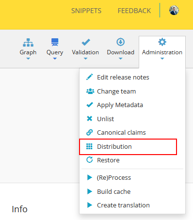
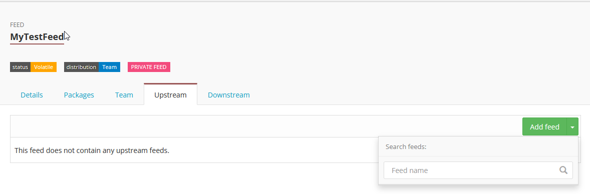

.. _package_feeds_technical_reference:

Technical reference
===================

This page contains the technical reference for working with package feeds in Simplifier. If you are new to feeds, start with the :doc:`Getting started guide <getting-started>`.

Feed status
-----------

.. list-table::
   :header-rows: 1

   * - Status
     - Meaning
   * - Volatile
     - The feed is still being set up. Its contents can change and it can be deleted.
   * - Permanent
     - The feed is locked for stable use. It cannot be deleted, and only permanent feeds can be used as upstream feeds.

Managing a feed
---------------

Updating title, key, and distribution
~~~~~~~~~~~~~~~~~~~~~~~~~~~~~~~~~~~~~

Feed admins can manage a feed from the **Feeds** tab on the organization or portal page, or from the feed page itself.

Feed admins can update the title, feed key, and distribution settings after creation. For permanent feeds, the feed key cannot be changed.

Distribution details are viewable under **Administration > Distribution**, showing only the versions accessible to the current user. Anonymous users see only public versions, while package admins see both public and private versions.

Deleting a feed
~~~~~~~~~~~~~~~

A feed can only be deleted when all of the following are true:

* The feed is not marked as permanent.
* The feed is not currently assigned to any project.
* The feed contains no published packages.

If a feed contains packages that have been soft-deleted, you are warned before deletion proceeds. Those packages become permanently unavailable.

Enterprise: creating feeds from org scope
~~~~~~~~~~~~~~~~~~~~~~~~~~~~~~~~~~~~~~~~~

Enterprise users can create feeds in advance from the organization **Feeds** tab before assigning feeds to projects. When creating a feed this way, you can select an existing organization team to manage it or create a new one.

Upstream feeds
--------------

Requirements and setup
~~~~~~~~~~~~~~~~~~~~~~

An upstream feed lets one feed draw on packages published in another feed without publishing copies yourself.

Requirements:

* Only **permanent** feeds can be used as an upstream feed.
* The upstream feed must be managed by the **same team** as the feed you are adding it to.
* You must have access to both feeds.

Set upstream feeds from the **Upstreams** tab on the feed page.

Restore behavior by source
~~~~~~~~~~~~~~~~~~~~~~~~~~

Each package in a feed is tagged by source:

.. list-table::
   :header-rows: 1

   * - Source
     - Meaning
   * - Project
     - Published directly to this feed from a Simplifier project.
   * - API
     - Published directly to this feed via the Simplifier packages API.
   * - Upstream
     - Pulled into this feed from an upstream feed during Restore.

Any package in a feed can be soft-deleted. Soft-deleted packages are hidden from users and dependency resolution.

Upstream-sourced packages can be restored automatically when needed by Restore. Directly published packages are not restored automatically; a feed admin must restore them manually.

Feed assignment rules
---------------------

Private vs. public projects
~~~~~~~~~~~~~~~~~~~~~~~~~~~

Which feeds you can assign depends on project type:

.. list-table::
   :header-rows: 1

   * - Project type
     - Available feeds
   * - Private project
     - Main Simplifier public feed, or any feed managed by the same team as the project.
   * - Public project
     - Main Simplifier public feed only.

Public projects cannot use private feeds. For the same reason, a private project with a private feed assigned cannot be converted to a public project.

Changing the assigned feed
~~~~~~~~~~~~~~~~~~~~~~~~~~

A project feed is changed from **Manage > Choose Feed**. Each feed change deletes the project dependency closure and requires a full Restore.

Dependency closure and Restore
~~~~~~~~~~~~~~~~~~~~~~~~~~~~~~

The dependency closure is the full resolved dependency set for a project, including direct and indirect dependencies.

The closure is used for resource rendering, resource validation, quality control checks, and baking your project into a package.

Restore is a manual step.

Feeds and other features
------------------------

Implementation Guides
~~~~~~~~~~~~~~~~~~~~~

Private packages can be used as Implementation Guide scope when the package is in the feed assigned to the project where the guide lives.

In the guide editor, go to **Settings > Scope**.

If you lose access to the feed that contains your guide scope package, you also lose the ability to render that guide.

Validator, Playground, and Docs Resolve
~~~~~~~~~~~~~~~~~~~~~~~~~~~~~~~~~~~~~~~

When selecting a scope in these pages, you can choose packages from feeds you have access to. To search in a specific feed, use:

::

   {feed-name}/{package-name}

If no feed is specified, only public packages are shown.

URL formats
~~~~~~~~~~~

Private package URL format:

::

   /feeds/{feed-key}/packages/{package-name}/{version}

Public package URL format:

::

   /packages/{package-name}/{version}

Package visibility is feed-specific. Two versions of the same package can have different visibility depending on feed.

Dependency history, latest-version calculation, and cached snapshots of a package are also feed-specific.

License and access
~~~~~~~~~~~~~~~~~~

The number of feeds you can create depends on your Simplifier license.

Access to feed packages is inherited from the managing team.

Current limitations
-------------------

Private-to-public promotion not supported
~~~~~~~~~~~~~~~~~~~~~~~~~~~~~~~~~~~~~~~~~

Making a private package public after it has already been published to a private feed is not supported.

Cross-team upstream feeds not supported
~~~~~~~~~~~~~~~~~~~~~~~~~~~~~~~~~~~~~~~

Setting upstream feeds across different teams is not supported.

New to feeds? Start with the :doc:`Getting started guide <getting-started>`.