.. _package_management:

Creating and publishing packages
================================

.. important::

    Before publishing a package, please make sure you read our :ref:`Package Policy <PackageCreationCheck>`.

Simplifier.net offers functionality to handle packages and dependencies. This functionality allows you to publish packages based on your project resources, which can be immediately installed and used by people implementing your profiles. The Simplifier FHIR package server is NPM compatible. You may either connect to this server using a NPM client or use our cross platform FHIR command line tool called Firely Terminal. On this page we will explain how to manage packages and dependencies in Simplifier, how to use Firely Terminal to install packages for validation, how to manage packages and how to create your own packages in Firely Terminal.

Package Releases
----------------

View releases
^^^^^^^^^^^^^
Visit the ``Releases`` tab of any Simplifier project to see which packages are published from this project. For more information about a package and its content, click on the name of the package. 

A package page has these tabs:

* ``Introduction``: the release notes given by the author of the package, how many conformance resources and examples it contains, and information such as when it was created, the project it is part of, its documentation and the feeds it is in.
* ``Files``: every file in the package. Search and filter them by resource category, core base type, example resource type and FHIR status, the same way as on the ``Resources`` tab of a project.
* ``Install``: the command you need to install the package. Click on the blue copy icon to copy it to your clipboard. Click on Firely Terminal or NPM to switch to your preferred tooling.
* ``Dependencies``: the dependencies to other packages, see :ref:`view_dependencies`.
* ``History``: the other versions of the package. Click on a version name to see the details.

Use ``Download`` in the menu at the top of the page to download the package, with or without snapshots.

A package URL can name a version range instead of an exact version. ``https://simplifier.net/packages/nictiz.fhir.nl.stu3.zib2017/1.3.x`` opens the highest listed ``1.3`` version; ``1.3`` and ``1.x`` work the same way. Pre-release and unlisted versions are skipped. If no version matches, Simplifier opens the newest version and tells you the requested version was not found.

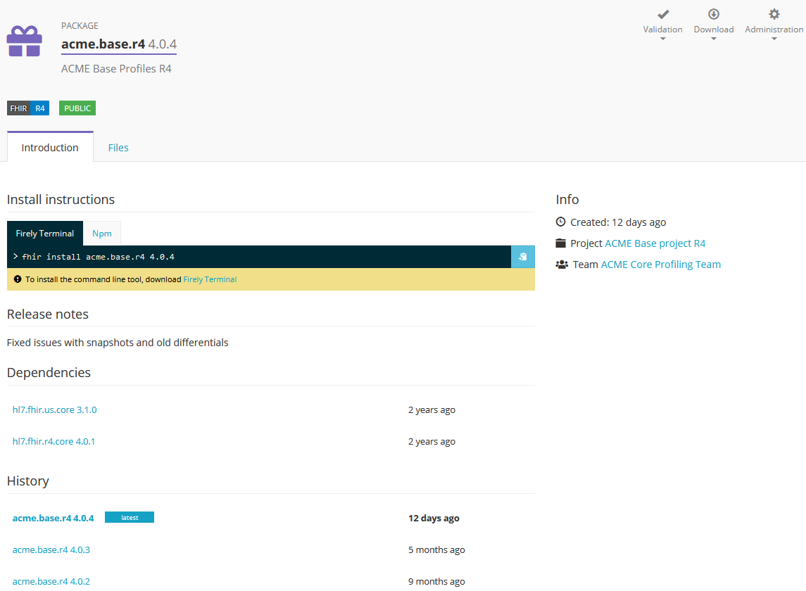

Switch to the ``Files`` tab to see the content of the package. 

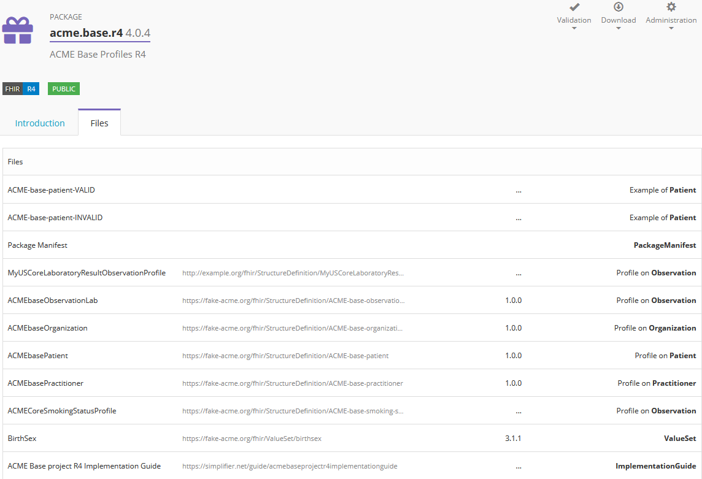

If you have a combination of private and public packages in your feeds you can see a full overview of your packages in the ``Distribution`` view accessible for package team members through the package Administration. 

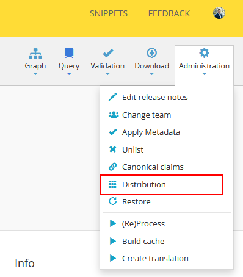

Create releases
^^^^^^^^^^^^^^^

Visit the ``Releases`` tab of your project and click on ``Create`` > ``Create new package`` to create a new package. Provide a name, version number, description and release notes for your package. Note that the name of your package should include at least one dot. Indicate if your package is a prelease package or not and click ``Create`` to publish your package. 
To create a new version of an existing package, click on ``Create`` and select ``Create new version for..`` followed by the name of your package. Add the required information and click ``Create`` to publish the new version of your package.

Packages can be created as private packages or public packages. Private packages are only visible for the team members inside the project from where the package is created and public packages will be visible to all of Simplifier. 

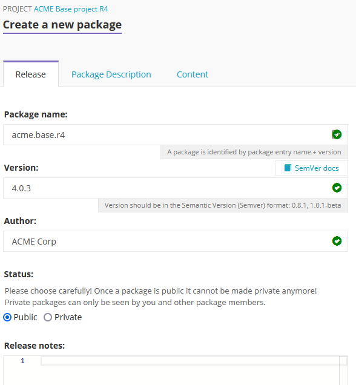
  

The package created with the highest semver will get the tag ``latest`` added to the package. Please `see how semver works with <https://semver.org>`_ regards to versioning and pre-release tags. 

.. _pin_canonical_references:

Pin canonical references
^^^^^^^^^^^^^^^^^^^^^^^^

When you create a package you can choose to pin its canonical references. Unversioned canonical references resolve to whatever version happens to be in scope, and that version can change as your dependencies evolve. Pinning locks each reference to the version found in the dependency closure at creation time, so the package keeps resolving to the versions you built and tested against.

You will find the option on the ``Content`` tab of the package creation wizard, under ``Versioning``. Tick ``Pin canonical references to their resolved version`` before you create the package.

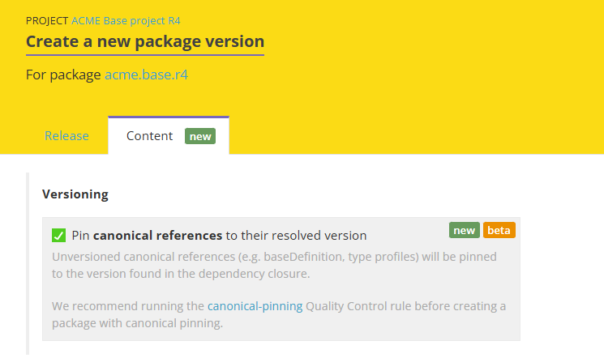

With this option enabled, when the package is created:

* Unversioned canonical references (for example ``baseDefinition`` or type profiles) are pinned to the version found in the dependency closure.
* Every resource that does not already have a version is given the package version in its ``version`` element.

How pinned and unpinned references are resolved is explained in :ref:`canonical_resolution`.

.. note::

    Canonical pinning is currently in beta. We recommend running the `canonical-pinning <https://simplifier.net/docs/QualityControl/Home/FHIR-actions/Pinning.page.md>`_ Quality Control rule before creating a package with pinning enabled, so you can catch any issues first.

Unlist releases
^^^^^^^^^^^^^^^
Once a package is created it can be used by other implementers to build their project on top of. For this reason we do not delete packages from the Registry. Once a package is created it is there to stay. Implementers can depend on the availability of published packaged. 

In some cases you might want new implementers to no longer find a specific version of a package. For these cases you can ``unlist`` a package. This can be done by the package owner in the package Administration. 

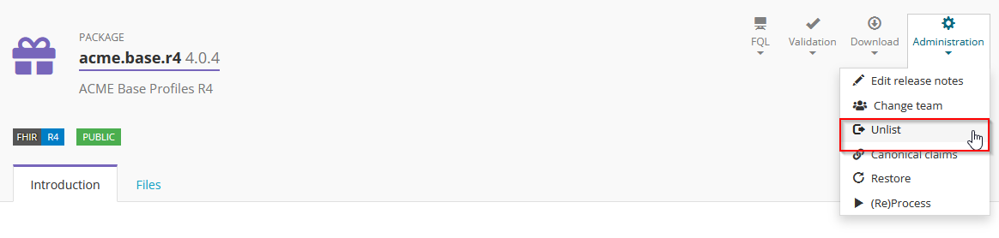

When a package is unlisted, it will no longer show up for implementers on the Registry or on Simplifier. As a creator of the package you will still be able to see the package with an unlisted label added.  

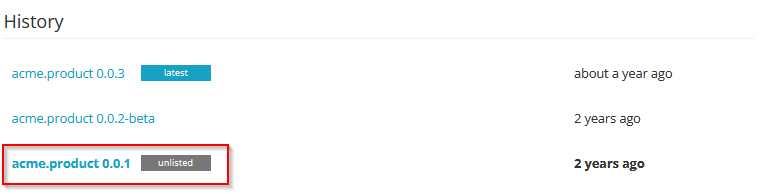

Bake Pipeline
-------------
Licensed Simplifier users are able to use our Bake Pipeline. The Bake pipeline is an important part of making high quality packages, but also other types of publications.

With a bake script you can define the internal structure and content of your package publication. See the FHIR Package Specification for the valid format of a FHIR package: https://confluence.hl7.org/display/FHIR/NPM+Package+Specification

On Simplifier you can start by creating your own package.bake.yaml file. 

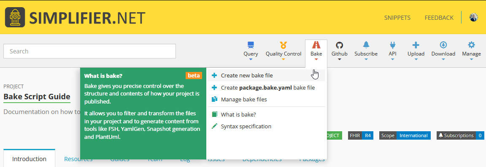

In that yaml file you can specify if you want snapshots included for all you resources, or if you only want a specific selection of resources and example instances added to your package. You can even transform FSH files in your project into resources when creating your package!

See the full :ref:`Bake syntax documentation <bake>` for the script format, all available steps, and a worked example.

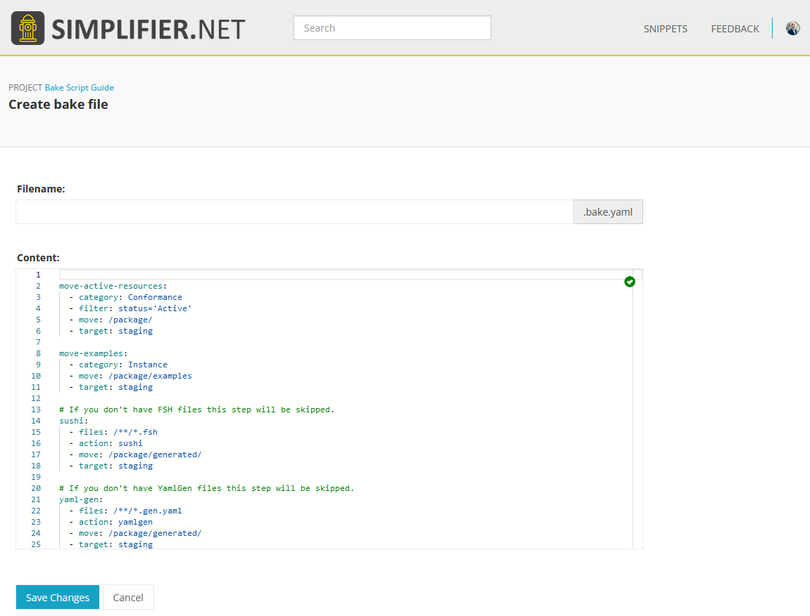

When a package.bake.yaml file is available, Simplifier will use that file to determine the content of the package you are creating. 

Below you can find an example of how to use the package.bake.yaml file in your own project. 

.. code-block:: yaml

  # Transform all resources to JSON (Mandatory according to the specification)
  transform-to-json:
    - source: input
    - category: Resource
    - transform: json
    - target: bucket1

  # Generate snapshots for all StructureDefinitions (Optional)
  # Note, since the file names stay the same the files will be overwritten and we do not need an extra bucket.
  generate-snapshots:
    - source: bucket1
    - category: Profile
    - action: snapshot
    - target: bucket1

  # Move all conformance resources to the /package folder (Mandatory according to the specification)
  move-conformance-resources:
    - source: bucket1
    - category: Conformance
    - move: /package/
    - target: output

  # Move all examples to the /package/examples folder (Optional)
  move-examples:
    - source: bucket1
    - category: Instance
    - move: /package/examples
    - target: output

  # Move the Package Manifest to the /package folder (Mandatory according to the specification)
  manifest:
    - source: input
    - files: package.json
    - move: /package

  # Generate an .index.json file with all files in the package (Optional)
  index-file:
    - source: output
    - files: /package/**/*.json
    - action: create-package-index
    - move: /package

Dependencies
-----------------------

.. _view_dependencies:

View dependencies
^^^^^^^^^^^^^^^^^
Visit the ``Dependencies`` tab of any Simplifier project to see its dependencies. The tab has two tables:

* ``Direct dependencies``: the packages you asked for in ``package.json``.
* ``All dependencies``: what they resolved to, including the indirect dependencies (the dependencies of your dependencies). Direct dependencies are shown in bold.

``All dependencies`` can list the same package more than once, in different versions, when your dependencies ask for different versions of it. All of them are in scope; which one a reference uses is explained in :ref:`canonical_resolution`.

Each dependency shows its FHIR version. Tags point out packages that need attention:

* ``Mismatch``: the FHIR version of this package does not match the FHIR version of your project.
* ``Unlisted``: the author has unlisted this version. Consider upgrading or downgrading.
* ``Pre-Release``: a pre-release package, which should not be used in an official package release.
* ``Missing``: the dependency could not be found. Run a restore.
* ``Uppercase`` and ``InvalidChars``: the package name contains uppercase letters or invalid characters.

The ``Dependencies`` tab of a package lists its dependencies with their version, FHIR version and release date, and the same ``Unlisted`` and ``Missing`` tags.

Click on the name of one of the listed packages to see the details of this package.

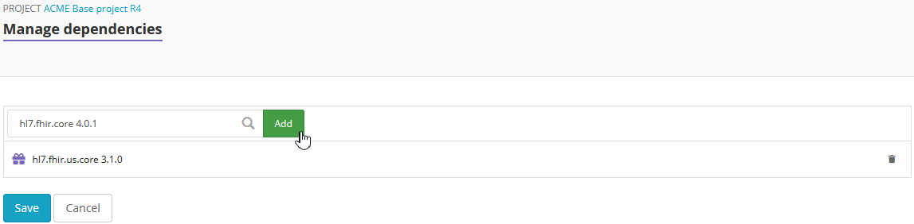

Add dependencies
^^^^^^^^^^^^^^^^
Visit the ``Dependencies`` tab to add dependencies to your project. There are two ways to do so. One way is to browse Simplifier for existing packages and add them to your project. The other way is to directly edit the JSON code.

Click ``Manage`` to search for existing dependencies. Type a search string in the search box and select a package and its version from the search results. Click ``Add`` to add the package to your project. When you are finished adding packages click ``Save`` to save the changes to your project.

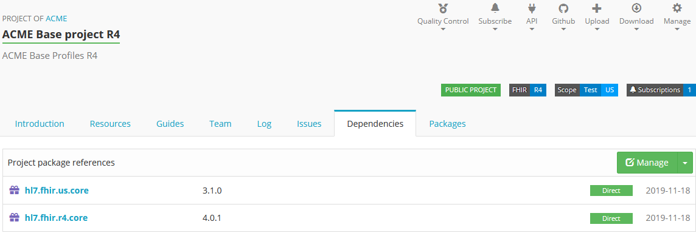

Click ``Edit`` to directly edit the JSON code and add the packages and their version to ``dependencies``.

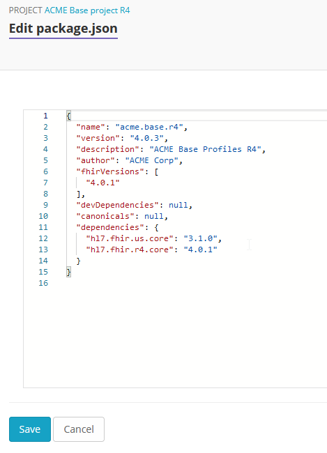

Remove dependencies
^^^^^^^^^^^^^^^^^^^
To remove dependencies from your project, you could either select ``Manage`` and click on the recycle bin icon next to the package you want to remove or select ``Edit package.json`` to directly edit the JSON code.

Restore dependencies
^^^^^^^^^^^^^^^^^^^^
A restore resolves the dependencies in your ``package.json`` again and updates ``All dependencies``. Click ``Restore`` on the ``Dependencies`` tab when:

* you edited ``package.json`` directly, or imported an updated one from GitHub;
* the tab says ``Your resolved dependencies are outdated. Run restore to update them.`` or ``Your resolved dependencies are invalid. Run restore to update them.``;
* the tab says ``Some dependencies could not be found. Run restore to try resolving them again.``

The ``Restore`` button turns green when a restore is needed.

Firely Terminal
-----------------------

.. important::

    Packages published outside of the Simplifier projects no longer show up under the Releases tab.

Firely Terminal is our (free) command line tool for FHIR. Firely Terminal allows you to communicate with any FHIR server. With simple commands you can easily download, upload, validate and transform resources, zip them, bundle them or split bundles. Firely Terminal offers many features. One of them is to install and create FHIR packages.

Learn :ref:`more about Firely Terminal <firely_terminal_docs:firely_terminal_home>` and :ref:`managing FHIR packages on the command line in particular <firely_terminal_docs:Package_management>`.