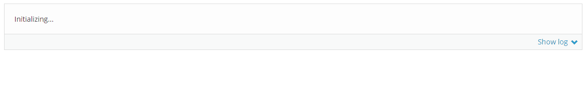
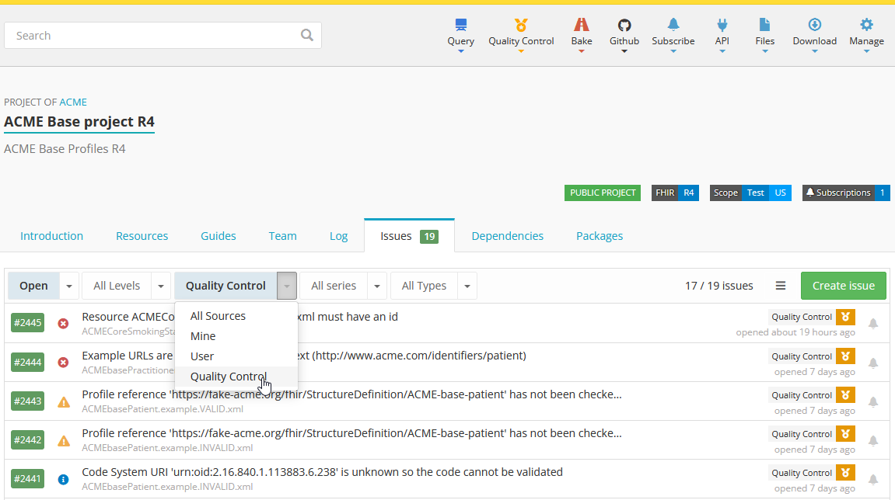

.. _qc_syntax_introduction:

Introduction
============

*Simplifier.net*, *Forge* and *Firely Terminal* come with a Quality Control Engine to help you improve the quality of your FHIR projects. The QC engine performs a series of rule checks on selected files in your project, on your local computer, or on every change to your source code repository. By default there are three rule series (free, minimal and recommended) that you can run on your project (described below), but you can also define your own rules.

   Quality Control being executed on a project

On Simplifier, the output is saved in the Issues tab at the project level. You can filter on Quality Control there to see the issues found.

Following one of the core principles of Simplifier, *eating your own dogfood*, you use the same language (YAML) that we used for the defaults to define your own rules. This way we share the experience and deal with the same challenges that you would face as a user. It is the same reason we write all our documentation in the Simplifier Implementation Guide editor.

Rule files
----------

You can add ``*.rules.yaml`` files to your project. All rules files in the root are exposed in the Quality Control menu of your project, so that any authorized user can run them. You get all the power of the FHIR Compute Cloud behind Simplifier to run these checks.

**File format**: a YAML rules file is named ``<name>.rules.yaml``. A ruleset file consists of entries; each entry starts with a dash, followed by a series of indented key-value pairs. (The comments below are not part of the entry; they just describe how to read it.)

::

   # comment for first entry
   - first: value
     second: value
     third: value

   # comment for second entry
   - first: value
     second: value
     third: value

**Default rule set**: Simplifier provides a default rule set, accessible to every project: ``default.rules.yaml``. If you do not wish to use the default rules, you can provide your own version of ``default.rules.yaml``.

**Custom rule sets**: you can add other rule files to your project, as long as their name follows the pattern ``<name>.rules.yaml``. It does not matter where you place them; they are all discovered by the system and exposed in the Quality Control menu.

**Running individual sets**: in Simplifier and Firely Terminal you can run individual rule sets, in which case the default set and other sets are not run. You can include other rule sets in a rules file with the :ref:`include <qc_actions>` action.

Default rule series
-------------------

Simplifier provides three default rule series: free, minimal, and recommended.

**Free series**: available to all users. It checks whether resources can be parsed as FHIR resources, whether they include an ``.id`` element, and whether a version is set. That last check supports canonical pinning during release (see :ref:`Pinning <qc_fhir-actions>`).

**Minimal series**: a very small set of rules that we know everyone agrees on. The bulk validation rule is included in the minimal series. Bulk validation is one of the most extensive forms of validation, so in that respect the minimal series is not small; it is, however, what the FHIR standard describes that resources should adhere to.

**Recommended series**: a more opinionated set of rules, of what we believe a FHIR project should conform to. We acknowledge that these are more opinionated, so we separated them. Here you can think of rules like 'every resource should have an id'.

.. note::

   *(migration TODO)* The free, minimal and recommended rule sets are rendered live on Simplifier and are a snapshot in time, subject to change. Review whether to add a static copy or screenshot here.
